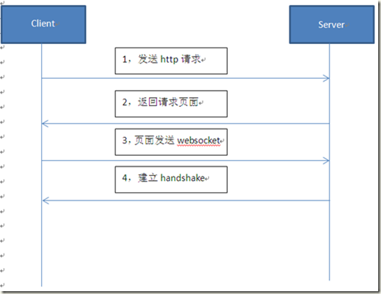
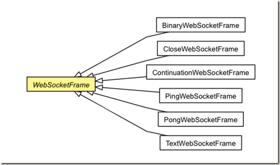

## 类

###  ChannelGroup

ChannelGroup是一个线程安全的集合，它提供了打开一个Channel和不同批量的方法。

* 当组中的channel关闭时会自动从组中移除
* 一个channel可以属于多个ChannelGroup。
* 其writeAndFlush()方法可以向集合中的所有channel广播消息

> 当一个ChannelGroup中即存在ServerChanel又存在non-ServerChannel时，执行IO操作时会优先执行ServerChannel中的方法。


**方法说明**

```java
    //返回ChannelGroup的名称
    String name();

    //通过channelId查找相应的Channel
    Channel find(ChannelId id);
    
    //异步地将消息写到所有的Channel中
    ChannelGroupFuture write(Object message);

    ChannelGroupFuture write(Object message, ChannelMatcher matcher);

    ChannelGroupFuture write(Object message, ChannelMatcher matcher, boolean voidPromise);

    ChannelGroup flush();

    ChannelGroup flush(ChannelMatcher matcher);

    ChannelGroupFuture writeAndFlush(Object message);

    @Deprecated
    ChannelGroupFuture flushAndWrite(Object message);

    ChannelGroupFuture writeAndFlush(Object message, ChannelMatcher matcher);

    ChannelGroupFuture writeAndFlush(Object message, ChannelMatcher matcher, boolean voidPromise);

    @Deprecated
    ChannelGroupFuture flushAndWrite(Object message, ChannelMatcher matcher);

    //将所有通道与远程端断开连接
    ChannelGroupFuture disconnect();

    ChannelGroupFuture disconnect(ChannelMatcher matcher);

    //关闭所有的通道
    ChannelGroupFuture close();

    ChannelGroupFuture close(ChannelMatcher matcher);

    @Deprecated
    ChannelGroupFuture deregister();

    @Deprecated
    ChannelGroupFuture deregister(ChannelMatcher matcher);

    //返回一个ChannelGroupFuture，当所有的channel关闭时，会得到相应的通知
    ChannelGroupFuture newCloseFuture();

    ChannelGroupFuture newCloseFuture(ChannelMatcher matcher);
```

### WebSocketFrame



WebSocketFrame类别



| 名称                       | 解释                           |
| -------------------------- | ------------------------------ |
| BinaryWebSocketFrame       | 二进制数据                     |
| CloseWebSocketFrame        | 结束消息                       |
| ContinuationWebSocketFrame | 数据被拆分为多个websocketframe |
| PingWebSocketFrame         | ping消息，二进制数据           |
| PongWebSocketFrame         | pong消息，二进制数据           |
| TextWebSocketFrame         | 文本消息，Utf-8数据            |


### fastjson

fastjson.JSONObject之对象与JSON转换方法

```java
//Java对象转换成String类型的JSON字符串
JSONObject.toJSONString(Java对象)
 
//String类型的JSON字符串转换成Java对象
JSONObject.toJavaObject(JSON字符串,Java对象.class)
 
//Json字符串转换成JSONObject对象
JSONObject.parseObject(JSON字符串)
 
//JSON字符串转换成Java对象
JSONObject.parseObject(JSON字符串,Java对象.class)
```

## 问题集合

### nginx配置反向代理解决跨域问题

### 多个ChannelGroup时

[netty在需要创建多个ChannelGroup的时候该如何如何设置线程池_慕课猿问 (imooc.com)](https://www.imooc.com/wenda/detail/450521)


##  异常

### com.alibaba.fastjson.JSONException

```java
com.alibaba.fastjson.JSONException: syntax error, pos 1, line 1, column 2ddd
```


### io.netty.util.IllegalReferenceCountException: refCnt: 0, increment: 1

> 原因是这是因为Netty有引用计数器的原因，自从Netty 4开始，对象的生命周期由它们的引用计数（reference counts）管理，而不是由垃圾收集器（garbage collector）管理了。
>  ByteBuf是最值得注意的，它使用了引用计数来改进分配内存和释放内存的性能。在我们创建ByteBuf对象后，它的引用计数是1，当你释放（release）引用计数对象时，它的引用计数减1，如果引用计数为0，这个引用计数对象会被释放（deallocate）,并返回对象池。
>  当尝试访问引用计数为0的引用计数对象会抛出IllegalReferenceCountException异常：

### 远程主机强迫关闭了一个连接


### Constant expression required

switch结合Enum的使用，报错


- switch的case只能使用常量，在编译时就能识别的量。
- Enum的使用

`switch支持的类型`：byte,short，char，int四种整形类型，枚举类型和java.lang.String类型（从java 7才允许）

**最终正确的写法**

```java
//解析消息体
JSONObject json = JSONObject.parseObject(text);
String c = (String) json.get("code");
MessageCode code = MessageCode.valueOf(c);
//判断消息类型
switch (code){
    case PING_CODE:
    case PONG_CODE:
        log.info("PING or PONG");
        return;
    case AUTH_CODE:
    case MESS_CODE:
        break;
    default:
        log.info("wring code");
        return;
}
```


## 方案

### 匹配聊天

**方案1**

* 登录时即建立长连接
* 匹配时发送code为匹配消息，加入匹配集合group中
* group广播消息

缺点：会一直保持连接，即时没有消息要发送


### 好友聊天

**方案1**

* 登录时即建立长连接

  

* 好友发送消息时，code为普通消息，from为发送消息用户id，to为接受消息用户id，message为消息内容，time为发送时间

* 服务端收到消息之后，向发消息和收消息的两个用户都进行广播发送

 