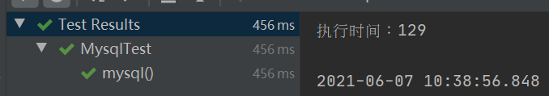
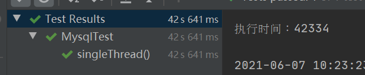

# 类

## SimpleChannelOutBoundHandler


## netty定时器HashedWheelTimer


## ChannelMatcher


# 问题集合

## 如何从set中随机取key

1.获取随机数，计数并循环遍历set，当计数达到随机数时取出key


## Iterator是按什么顺序遍历？

根据hashcode从小到大进行遍历

## 秒杀项目的思考：使用定时器代替消息队列执行

缺点：

1. 库存流水还要加一个字段值:更新成功，以避免下次扫描又改库存

这样就做两件事了，既要改库存流水，也要改库存，仅仅从这一点消息队列就稍好一些。

2. 如果不在秒杀活动时，定时任务依然在继续执行，这白白消耗资源吧。

这样得在定时器里定个结束条件，而且还得定个秒杀活动启动时定时器一起启动

3. 

## mysql数据库1000个线程修改统同一数据和1个线程修改同一数据1000次的比较

* 1000个线程修改

```java
@Test
public void mysql() throws InterruptedException {
    long start = System.currentTimeMillis();
    CountDownLatch countDownLatch = new CountDownLatch(1000);
    for (int i = 0; i <1000 ; i++) {
        Mysql mysql = new Mysql(i, provinceMapper);
        countDownLatch.countDown();
        new Thread(mysql).start();
    }
    countDownLatch.await();
    long end = System.currentTimeMillis();
    System.out.println("执行时间："+(end-start));
}
```



* 1个线程修改1000次

```java
    @Test
    public void singleThread(){
        long start = System.currentTimeMillis();
        for (int i = 0; i <1000 ; i++) {
            provinceMapper.update(55,i+"");
        }
        long end = System.currentTimeMillis();
        System.out.println("执行时间："+(end-start));
    }

```




# 异常

###  io.netty.channel.DefaultChannelPipeline

```java
[ntLoopGroup-8-1] io.netty.channel.DefaultChannelPipeline  : An exceptionCaught() event was fired, and it reached at the tail of the pipeline. It usually means the last handler in the pipeline did not handle the exception.
```

handler报错了，报了空指针异常


### java.lang.IllegalStateException

```java
java.lang.IllegalStateException: Unable to find a @SpringBootConfiguration, you need to use @ContextConfiguration or @SpringBootTest(classes=...) with your test

```

解决：

```java
@SpringBootTest(classes = SpringbootApplication.class)//这边把启动类加上
public class MysqlTest {
	......
}
```


# 方案

## 匹配聊天

方案2.0

* 